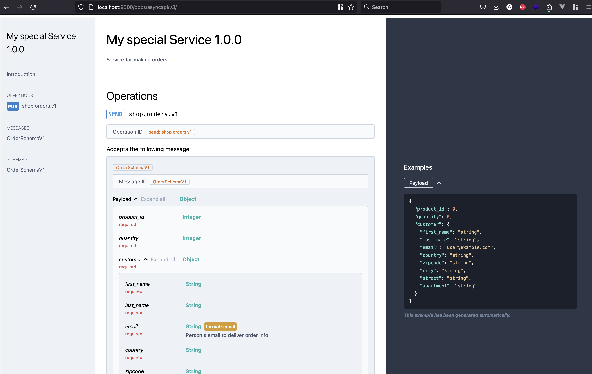

<p align="center">
  

<h1 align="center">
 fastest-asyncapi
</h1>

<p align="center"> Use pydantic model to construct asyncapi docs and serve inside your asyncapi app </p>


</p>

## Installation

Install using `pip` or `poetry`

```shell 
poetry add fastest-asyncapi
```

## Usage

1. Describe your specification using pydantic models
```python
from asyncapi_container.asyncapi.spec.v3.info import Info
from asyncapi_container.containers.v3.simple_spec import SimpleSpecV3
from asyncapi_container.custom_types import RoutingMap
from pydantic import BaseModel, Field


class Customer(BaseModel):
    first_name: str = Field(..., title='First Name')
    last_name: str = Field(..., title='Last Name')
    email: str = Field(..., title='Email', format="email", description="Person's email to deliver order info")
    country: str = Field(..., title='Country')
    zipcode: str = Field(..., title='Zipcode')
    city: str = Field(..., title='City')
    street: str = Field(..., title='Street')
    apartment: str = Field(..., title='Apartment')


class OrderSchemaV1(BaseModel):
    product_id: int = Field(..., title='Product Id')
    quantity: int = Field(..., title='Quantity')
    customer: Customer


class MySpecialServiceAsyncAPISpecV3(SimpleSpecV3):
    info: Info = Info(
        title="My special Service",
        version="1.0.0",
        description="Service for making orders"
    )
    sends: RoutingMap = {
        "shop.orders.v1": [
            OrderSchemaV1,
        ]
    }
    receives: RoutingMap = {}
```

2. Configure `fast-and-async-api` app using asyncapi spec definition from above Mount `fastapi-asyncapi` urls.

```python

from fastapi import FastAPI

from fastest_asyncapi.views.sync.v3.asyncapi import fastest_asyncapi_app

app = FastAPI()

fastest_asyncapi_app.configure(asyncapi_spec_classes=[MySpecialServiceAsyncAPISpecV3])
app.mount("/docs/", fastest_asyncapi_app)

```

3. Enjoy your results by navigating to `docs/asyncapi/v3/`




<p align="center">
  


<p align="center"> PS: images generated by AI </p>


</p>